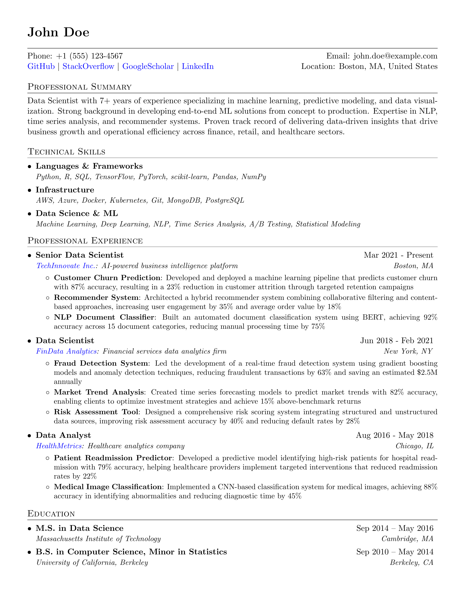

# YAML to PDF Resume Builder



A flexible system to generate professional PDF resumes from structured YAML data using Python and LaTeX.

## Overview

This project allows you to maintain your resume content in an easy-to-edit YAML format while generating a professionally styled PDF using LaTeX. You can run it either locally or with Docker.

## Usage Options

### Option 1: Local Installation

#### Requirements
- Python 3.6+
- PyYAML (`pip install pyyaml`)
- LaTeX distribution (MacTeX, MiKTeX, or TeXLive)

#### Quick Start

```bash
# Activate the virtual environment (if you have one)
source venv/bin/activate

# Generate your resume
python generate_resume.py
```

### Option 2: Docker (No Local Dependencies)

#### Requirements
- Docker
- Docker Compose

#### Quick Start

```bash
# Start the container in the background
docker-compose up -d --build

# Generate your resume
docker exec -it resume-generator python3 generate_resume.py

# Stop the container when done
docker-compose down
```

## How It Works

1. Your resume content is stored in `resume.yaml` as structured YAML data
2. The LaTeX template (`template.tex`) defines the styling and layout
3. The Python script (`generate_resume.py`) combines your data with the template
4. The script generates files named with your first and last name (e.g., `John_Doe.tex` and `John_Doe.pdf`)

## Creating Your Resume

1. **Edit Your Resume Data**:
   - Update `resume.yaml` with your personal information
   - Follow the existing structure for experience, education, etc.

2. **Customizing the Template** (Optional):
   - Edit `template.tex` to change the styling and layout
