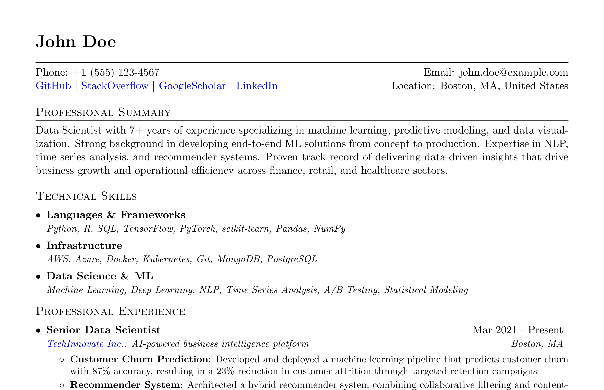

# YAML to PDF Resume Builder



## Overview

This project allows you to maintain your resume content in an easy-to-edit YAML format while generating a professionally styled PDF using Python and LaTeX. You can run it either as a **command-line tool**, a **FastAPI web service**, or with **Docker**.

## Usage Options

### Option 1: FastAPI Web Service (NEW! 🚀)

Run the resume builder as a web API service that accepts HTTP requests.

#### Requirements
- Python 3.6+
- All dependencies from `requirements.txt`
- LaTeX distribution (MacTeX, MiKTeX, or TeXLive)

#### Quick Start

```bash
# Install dependencies
pip install -r requirements.txt

# Start the FastAPI server
python3 main.py

# Or use uvicorn directly for development
uvicorn main:app --reload --host 0.0.0.0 --port 8000
```

The API will be available at `http://localhost:8000`

#### API Endpoints

- **GET `/`** - API information and available endpoints
- **GET `/health`** - Health check endpoint
- **POST `/generate-resume`** - Generate PDF from JSON resume data
- **POST `/upload-yaml`** - Upload a YAML file and generate PDF
- **POST `/generate-from-yaml`** - Generate resume.tex and resume.pdf from existing resume.yaml
- **GET `/download/{filename}`** - Download generated PDF files
- **GET `/sample-data`** - Get sample resume data structure
- **GET `/template`** - Get the LaTeX template content
- **DELETE `/cleanup`** - Clean up temporary files (dev endpoint)

#### API Documentation

FastAPI automatically generates interactive API documentation:
- **Swagger UI**: `http://localhost:8000/docs`
- **ReDoc**: `http://localhost:8000/redoc`

#### Usage Examples

**Generate resume with JSON data:**
```bash
curl -X POST "http://localhost:8000/generate-resume" \
  -H "Content-Type: application/json" \
  -d '{
    "name": "John Doe",
    "contact": {
      "phone": "+1 (555) 123-4567",
      "email": "john.doe@example.com",
      "location": "Boston, MA",
      "links": [
        {"name": "GitHub", "url": "https://github.com/johndoe"},
        {"name": "LinkedIn", "url": "https://linkedin.com/in/johndoe"}
      ]
    },
    "summary": "Experienced developer...",
    "skills": [
      {"category": "Programming", "items": "Python, JavaScript"}
    ],
    "experience": [...],
    "education": [...],
    "awards": [],
    "certifications": [],
    "publications": []
  }'
```

**Upload YAML file:**
```bash
curl -X POST "http://localhost:8000/upload-yaml" \
  -F "file=@resume.yaml"
```

**Generate from existing resume.yaml:**
```bash
curl -X POST "http://localhost:8000/generate-from-yaml"
```

**Download generated PDF:**
```bash
curl "http://localhost:8000/download/resume.pdf" \
  --output resume.pdf
```

**Test the API:**
```bash
# Run the provided test script
python3 test_api.py
```

### Option 2: Command Line (Original)

#### Requirements
- Python 3.6+
- PyYAML (`pip install pyyaml`)
- LaTeX distribution (MacTeX, MiKTeX, or TeXLive)

#### Quick Start

```bash
# Activate the virtual environment (if you have one)
source venv/bin/activate

# Generate your resume
python generate_resume.py
```

### Option 3: Docker

#### Requirements
- Docker

#### For FastAPI Service

```bash
# Build the container
docker build -t resume-generator .

# Run the FastAPI server with volume mounting (recommended)
docker run -p 8000:8000 -v $(pwd):/app resume-generator

# Access the API at http://localhost:8000
```

#### For Command Line (Original)

```bash
# Build the container
docker build -t resume-generator .

# Run the original command-line version
docker run --rm -v $(pwd):/app resume-generator python3 generate_resume.py
```

#### Important Note About Docker Volume Mounting

When using the `/generate-from-yaml` endpoint, you **must** use volume mounting (`-v $(pwd):/app`) to make the generated `resume.tex` and `resume.pdf` files accessible in your host project directory. Without volume mounting, the files will be generated inside the container but won't be accessible from your host system.

## How It Works

1. Your resume content is stored in `resume.yaml` as structured YAML data
2. The LaTeX template (`template.tex`) defines the styling and layout
3. The Python script (`generate_resume.py`) combines your data with the template
4. The FastAPI service (`main.py`) provides web endpoints for the same functionality
5. The endpoints can generate files either with personalized names or as standard `resume.tex` and `resume.pdf`
   - `/generate-resume` and `/upload-yaml`: Generate files with personalized names
   - `/generate-from-yaml`: Generate standard `resume.tex` and `resume.pdf` from existing `resume.yaml`

## Creating Your Resume

1. **Edit Your Resume Data**:
   - Update `resume.yaml` with your personal information
   - Follow the existing structure for experience, education, etc.

2. **Customizing the Template** (Optional):
   - Edit `template.tex` to change the styling and layout

## API Integration

The FastAPI service can be easily integrated into other applications:

### Python Client Example
```python
import requests

# Generate resume
response = requests.post('http://localhost:8000/generate-resume', json=resume_data)
result = response.json()

# Download PDF
pdf_response = requests.get(f"http://localhost:8000{result['download_url']}")
with open('resume.pdf', 'wb') as f:
    f.write(pdf_response.content)
```

### JavaScript/Node.js Client Example
```javascript
const FormData = require('form-data');
const fs = require('fs');

// Upload YAML file
const form = new FormData();
form.append('file', fs.createReadStream('resume.yaml'));

fetch('http://localhost:8000/upload-yaml', {
  method: 'POST',
  body: form
})
.then(response => response.json())
.then(data => console.log(data));
```

## Development

### Running in Development Mode
```bash
# Install dependencies
pip install -r requirements.txt

# Run with auto-reload
uvicorn main:app --reload

# Run tests
python3 test_api.py
```

### Project Structure
```
yaml2pdf-resume-builder/
├── main.py              # FastAPI application
├── generate_resume.py   # Core resume generation logic
├── test_api.py         # API test script
├── template.tex        # LaTeX template
├── resume.yaml         # Sample resume data
├── requirements.txt    # Python dependencies
├── Dockerfile         # Docker configuration
└── README.md          # This file
```
